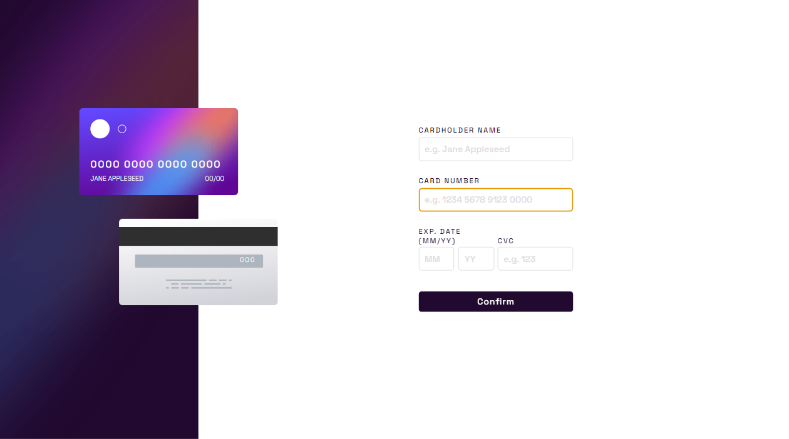
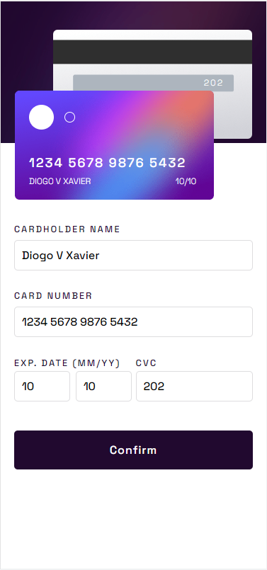

# Frontend Mentor - Interactive card details form solution

This is a solution to the [Interactive card details form challenge on Frontend Mentor](https://www.frontendmentor.io/challenges/interactive-card-details-form-XpS8cKZDWw). Frontend Mentor challenges help you improve your coding skills by building realistic projects. 

## Table of contents

- [Overview](#overview)
  - [The challenge](#the-challenge)
  - [Screenshot](#screenshot)
  - [Links](#links)
- [My process](#my-process)
  - [Built with](#built-with)
  - [What I learned](#what-i-learned)
  - [Continued development](#continued-development)
- [Author](#author)
- [Acknowledgments](#acknowledgments)


## Overview

### The challenge

Users should be able to:

- Fill in the form and see the card details update in real-time
- Receive error messages when the form is submitted if:
  - Any input field is empty
  - The card number, expiry date, or CVC fields are in the wrong format
- View the optimal layout depending on their device's screen size
- See hover, active, and focus states for interactive elements on the page

### Screenshot




### Links

- Solution URL: [https://diogovx.github.io/interactive-card-details-form-main/](https://diogovx.github.io/interactive-card-details-form-main/)

## My process

### Built with

- Semantic HTML5 markup
- CSS custom properties
- Flexbox
- Mobile-first workflow

### What I learned

This project is very useful for learning about html forms and how you can modify it.
I learn some new commands from JavaScript.

```js
function mcc(v){
    v=v.replace(/\D/g,"");
    v=v.replace(/^(\d{4})(\d)/g,"$1 $2");
    v=v.replace(/^(\d{4})\s(\d{4})(\d)/g,"$1 $2 $3");
    v=v.replace(/^(\d{4})\s(\d{4})\s(\d{4})(\d)/g,"$1 $2 $3 $4");
    return v;
}
```

### Continued development

This is a project that you can use on some websites that use shopping functions, like an e-commerce for example.


## Author

- Frontend Mentor - [@Diogovx](https://www.frontendmentor.io/profile/yourusername)
- Twitter - [@Diogovx_](https://www.twitter.com/Diogovx_)
